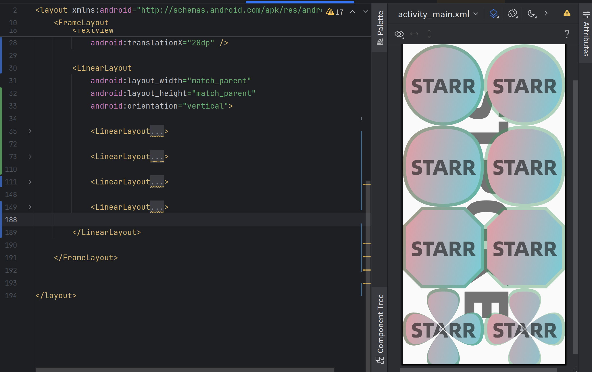

# CardViews
一款好用的android倒角（倒圆角，二阶贝塞尔倒角，三阶贝塞尔倒角）、边框、渐变UI基础组件，他是基于原生组件（FrameLayout、LinearLayout、ConstraintLayout、TextView、ImageView）扩展了更多功能，使用这些组件之后你不必再需要写那些烦人的drawable文件;组件的属性在清单文件中能直接被渲染，所见即所得。

## 用法
- **`线性渐变`**

    **属性：card_linear_gradient**   

    格式：orientation,colorsNum,#FFFFFF,#000000,#FF0000,positionNum,0,0.3,1

    这个格式设计灵感来自网络协议的数据包，用一个字符串来描述线性渐变

    orientation表示线性渐变的方向，可取值如下

        字符串类型：
        LEFT_RIGHT， LT_RB， TOP_BOTTOM， RT_LB， RIGHT_LEFT， RB_LT， BOTTOM_TOP， LB_RT
        数值类型（表示角度，0表示x轴正方向，角度增加方向为顺时针方向）：
        0,33.3,45,120...
    
    colorsNum表示渐变的颜色采样数

    positionNum表示渐变的颜色位置

    colorsNum必须和positionNum相等

    示例：    

    <details>
    <summary>代码:两个颜色渐变</summary>
  
    ```
    <FrameLayout
        android:id="@+id/main"
        android:layout_width="match_parent"
        android:layout_height="match_parent"
        tools:context=".MainActivity">

        <com.wustfly.cardviews.TextCard
            android:layout_width="match_parent"
            android:layout_height="match_parent"
            app:card_linear_gradient="LEFT_RIGHT,2,#E09FA7,#7DCBD5,2,0,1" />

    </FrameLayout>
    ```
    </details>
    效果：
  
    

    <details>
    <summary>代码:三个颜色渐变</summary>
  
    ```
    <FrameLayout
        android:id="@+id/main"
        android:layout_width="match_parent"
        android:layout_height="match_parent"
        tools:context=".MainActivity">

        <com.wustfly.cardviews.TextCard
            android:layout_width="match_parent"
            android:layout_height="match_parent"
            app:card_linear_gradient="12.5,3,#E09FA7,#66FFFF00,#7DCBD5,3,0,0.5,1" />

    </FrameLayout>
    ```
    </details>
    效果：
  
    

- **`设置View高宽比`**

    **属性：card_dimension_ratio**

    格式：2:1(表示宽高比为2：1)

    在使用这个属性时需注意:

    1.须指定view的高度或宽度，另一个设置为0dp

    2.不建议在view的parent为ConstraintLayout中使用该属性，因为ConstraintLayout已有相关的高宽比表达

    示例：

    <details>
    <summary>代码:高宽比1:1</summary>
  
    ```
    <FrameLayout
        android:id="@+id/main"
        android:layout_width="match_parent"
        android:layout_height="match_parent"
        tools:context=".MainActivity">

        <com.wustfly.cardviews.TextCard
            android:layout_width="match_parent"
            android:layout_height="0dp"
            android:layout_gravity="center"
            app:card_dimension_ratio="1:1"
            app:card_linear_gradient="12.5,3,#E09FA7,#66FFFF00,#7DCBD5,3,0,0.5,1" />

    </FrameLayout>
    ```
    </details>
    效果：
  
    

    <details>
    <summary>代码:高宽比1:4</summary>
  
    ```
    <FrameLayout
        android:id="@+id/main"
        android:layout_width="match_parent"
        android:layout_height="match_parent"
        tools:context=".MainActivity">

        <com.wustfly.cardviews.TextCard
            android:layout_width="0dp"
            android:layout_height="match_parent"
            android:layout_gravity="center"
            app:card_dimension_ratio="1:4"
            app:card_linear_gradient="12.5,3,#E09FA7,#66FFFF00,#7DCBD5,3,0,0.5,1" />

    </FrameLayout>
    ```
    </details>
    效果：
  
    

    <details>
    <summary>代码:配合LinearLayout的layout_weight属性做比例布局</summary>
    
    ```
    <LinearLayout
        android:id="@+id/main"
        android:layout_width="match_parent"
        android:layout_height="match_parent"
        android:orientation="horizontal"
        tools:context=".MainActivity">

        <com.wustfly.cardviews.TextCard
            android:layout_width="0dp"
            android:layout_height="0dp"
            android:layout_weight="1"
            app:card_linear_gradient="LEFT_RIGHT,2,#E09FA7,#7DCBD5,2,0,1"
            app:card_dimension_ratio="1:1" />

        <com.wustfly.cardviews.TextCard
            android:layout_width="0dp"
            android:layout_height="0dp"
            android:layout_weight="2"
            app:card_linear_gradient="LEFT_RIGHT,2,#E09FA7,#7DCBD5,2,0,1"
            app:card_dimension_ratio="1:1" />

        <com.wustfly.cardviews.TextCard
            android:layout_width="0dp"
            android:layout_height="0dp"
            android:layout_weight="4"
            app:card_linear_gradient="LEFT_RIGHT,2,#E09FA7,#7DCBD5,2,0,1"
            app:card_dimension_ratio="1:1" />

    </LinearLayout>
    ```
    </details>
    效果：
  
    

- **`倒角`**

    **属性：card_radius 使用xxxdp设置倒角的固定长度** 

    示例：
    <details>
    <summary>代码:倒60dp的圆角</summary>
  
    ```
    <FrameLayout
        android:id="@+id/main"
        android:layout_width="match_parent"
        android:layout_height="match_parent"
        tools:context=".MainActivity">

        <com.wustfly.cardviews.TextCard
            android:layout_width="match_parent"
            android:layout_height="0dp"
            android:layout_gravity="center"
            android:layout_marginHorizontal="20dp"
            app:card_dimension_ratio="1:1"
            app:card_linear_gradient="12.5,2,#E09FA7,#7DCBD5,2,0,1"
            app:card_radius="60dp" />

    </FrameLayout>
    ```
    </details>
    效果：
  
    

    **属性：card_radius_percent 使用iew高宽较小值为base乘以该值的百分比得到倒角长度**

    示例：
    <details>
    <summary>代码:通过设置正方形的倒角百分比为50%得到一个圆形view, 通常在圆形头像使用</summary>
  
    ```
    <FrameLayout
        android:id="@+id/main"
        android:layout_width="match_parent"
        android:layout_height="match_parent"
        tools:context=".MainActivity">

        <com.wustfly.cardviews.TextCard
            android:layout_width="match_parent"
            android:layout_height="0dp"
            android:layout_gravity="center"
            android:layout_marginHorizontal="20dp"
            app:card_dimension_ratio="1:1"
            app:card_linear_gradient="12.5,2,#E09FA7,#7DCBD5,2,0,1"
            app:card_radius_percent="50%" />

    </FrameLayout>
    ```
    </details>
    效果：
  
    

    **属性：
    card_radius_LT，
    card_radius_RT，
    card_radius_LB，
    card_radius_RB，
    单独设置每个角的倒角长度**

    示例：
    <details>
    <summary>代码:分别设置倒角长度</summary>
  
    ```
    <FrameLayout
        android:id="@+id/main"
        android:layout_width="match_parent"
        android:layout_height="match_parent"
        tools:context=".MainActivity">

        <com.wustfly.cardviews.TextCard
            android:layout_width="match_parent"
            android:layout_height="0dp"
            android:layout_gravity="center"
            android:layout_marginHorizontal="20dp"
            app:card_dimension_ratio="1:1"
            app:card_linear_gradient="12.5,2,#E09FA7,#7DCBD5,2,0,1"
            app:card_radius_LB="120dp"
            app:card_radius_LT="30dp"
            app:card_radius_RB="90dp"
            app:card_radius_RT="60dp" />

    </FrameLayout>
    ```
    </details>
    效果：
  
    

    **属性：
    card_radius_LT_percent，
    card_radius_RT_percent，
    card_radius_LB_percent，
    card_radius_RB_percent，
    单独设置每个角的倒角长度百分比**

    示例：
    <details>
    <summary>代码:分别设置倒角长度百分比</summary>
  
    ```
    <FrameLayout
        android:id="@+id/main"
        android:layout_width="match_parent"
        android:layout_height="match_parent"
        tools:context=".MainActivity">

        <com.wustfly.cardviews.TextCard
            android:layout_width="match_parent"
            android:layout_height="0dp"
            android:layout_gravity="center"
            android:layout_marginHorizontal="20dp"
            app:card_dimension_ratio="1:1"
            app:card_linear_gradient="12.5,2,#E09FA7,#7DCBD5,2,0,1"
            app:card_radius_LB_percent="90%"
            app:card_radius_LT_percent="10%"
            app:card_radius_RB_percent="10%"
            app:card_radius_RT_percent="90%" />

    </FrameLayout>
    ```
    </details>
    效果：
  
    

    **属性：card_corner_position 设置需要倒角位置**
    取值：LT,RT,LB,RB的组合
    示例：
    <details>
    <summary>代码:设置为LT|RT|LB</summary>
  
    ```
    <FrameLayout
        android:id="@+id/main"
        android:layout_width="match_parent"
        android:layout_height="match_parent"
        tools:context=".MainActivity">

        <com.wustfly.cardviews.TextCard
            android:layout_width="match_parent"
            android:layout_height="0dp"
            android:layout_gravity="center"
            android:layout_marginHorizontal="20dp"
            app:card_corner_position="LT|RT|LB"
            app:card_dimension_ratio="1:1"
            app:card_linear_gradient="12.5,2,#E09FA7,#7DCBD5,2,0,1"
            app:card_radius="60dp" />

    </FrameLayout>
    ```
    </details>
    效果：

    

    **属性：card_corner_style 设置倒角类型**
    取值：circle-圆角(default) quad-二次贝塞尔 cubic-三次贝塞尔 line-平角
    示例：circle和quad
    ```
    <LinearLayout
        android:id="@+id/main"
        android:layout_width="match_parent"
        android:layout_height="match_parent"
        android:clipChildren="false"
        android:gravity="center"
        android:orientation="vertical"
        tools:context=".MainActivity">

        <com.wustfly.cardviews.FrameCard
            android:layout_width="0dp"
            android:layout_height="0dp"
            android:layout_weight="1"
            android:clipChildren="false"
            android:textSize="33sp"
            app:card_corner_style="circle"
            app:card_dimension_ratio="1:1"
            app:card_linear_gradient="12.5,2,#E09FA7,#7DCBD5,2,0,1"
            app:card_radius_percent="50%">

            <TextView
                android:layout_width="wrap_content"
                android:layout_height="wrap_content"
                android:layout_gravity="center"
                android:fontFamily="@font/alibaba_puhuiti_105_heavy_105_heavy"
                android:paddingHorizontal="10dp"
                android:text="circle"
                android:textSize="66sp" />

        </com.wustfly.cardviews.FrameCard>

        <com.wustfly.cardviews.FrameCard
            android:layout_width="0dp"
            android:layout_height="0dp"
            android:layout_weight="1"
            android:clipChildren="false"
            android:textSize="33sp"
            app:card_corner_style="quad"
            app:card_dimension_ratio="1:1"
            app:card_linear_gradient="12.5,2,#E09FA7,#7DCBD5,2,0,1"
            app:card_radius_percent="50%">

            <TextView
                android:layout_width="wrap_content"
                android:layout_height="wrap_content"
                android:layout_gravity="center"
                android:fontFamily="@font/alibaba_puhuiti_105_heavy_105_heavy"
                android:paddingHorizontal="10dp"
                android:text="quad"
                android:textSize="66sp" />

        </com.wustfly.cardviews.FrameCard>

    </LinearLayout>
    ``` 
    
    示例：cubic
    **属性：card_cubic_coefficient 设置倒角类型为cubic时，该参数用来设置拟合系数**
    ```
    <LinearLayout
        android:id="@+id/main"
        android:layout_width="match_parent"
        android:layout_height="match_parent"
        android:clipChildren="false"
        android:gravity="center"
        android:padding="10dp"
        android:orientation="vertical"
        tools:context=".MainActivity">
        
        <LinearLayout
            android:layout_width="match_parent"
            android:orientation="horizontal"
            android:layout_height="wrap_content">
            
            <com.wustfly.cardviews.FrameCard
                android:layout_width="0dp"
                android:layout_height="0dp"
                android:layout_weight="1"
                android:textSize="33sp"
                app:card_corner_style="cubic"
                app:card_cubic_coefficient="0"
                app:card_dimension_ratio="1:1"
                app:card_linear_gradient="12.5,2,#E09FA7,#7DCBD5,2,0,1"
                app:card_radius_percent="50%">

                <TextView
                    android:layout_width="wrap_content"
                    android:layout_height="wrap_content"
                    android:layout_gravity="center"
                    android:fontFamily="@font/alibaba_puhuiti_105_heavy_105_heavy"
                    android:paddingHorizontal="10dp"
                    android:gravity="center"
                    android:text="cubic\n0"
                    android:textSize="33sp" />

            </com.wustfly.cardviews.FrameCard>

            <com.wustfly.cardviews.FrameCard
                android:layout_width="0dp"
                android:layout_height="0dp"
                android:layout_weight="1"
                android:textSize="33sp"
                app:card_corner_style="cubic"
                app:card_cubic_coefficient="0.2"
                app:card_dimension_ratio="1:1"
                app:card_linear_gradient="12.5,2,#E09FA7,#7DCBD5,2,0,1"
                app:card_radius_percent="50%">

                <TextView
                    android:layout_width="wrap_content"
                    android:layout_height="wrap_content"
                    android:layout_gravity="center"
                    android:fontFamily="@font/alibaba_puhuiti_105_heavy_105_heavy"
                    android:paddingHorizontal="10dp"
                    android:text="cubic\n0.2"
                    android:gravity="center"
                    android:textSize="33sp" />

            </com.wustfly.cardviews.FrameCard>
            
        </LinearLayout>
        
        <LinearLayout
            android:layout_width="match_parent"
            android:orientation="horizontal"
            android:layout_height="wrap_content">
            
            <com.wustfly.cardviews.FrameCard
                android:layout_width="0dp"
                android:layout_height="0dp"
                android:layout_weight="1"
                android:textSize="33sp"
                app:card_corner_style="cubic"
                app:card_cubic_coefficient="0.5"
                app:card_dimension_ratio="1:1"
                app:card_linear_gradient="12.5,2,#E09FA7,#7DCBD5,2,0,1"
                app:card_radius_percent="50%">

                <TextView
                    android:layout_width="wrap_content"
                    android:layout_height="wrap_content"
                    android:layout_gravity="center"
                    android:fontFamily="@font/alibaba_puhuiti_105_heavy_105_heavy"
                    android:paddingHorizontal="10dp"
                    android:text="cubic\n0.5"
                    android:gravity="center"
                    android:textSize="33sp" />

            </com.wustfly.cardviews.FrameCard>

            <com.wustfly.cardviews.FrameCard
                android:layout_width="0dp"
                android:layout_height="0dp"
                android:layout_weight="1"
                android:textSize="33sp"
                app:card_corner_style="cubic"
                app:card_cubic_coefficient="0.7"
                app:card_dimension_ratio="1:1"
                app:card_linear_gradient="12.5,2,#E09FA7,#7DCBD5,2,0,1"
                app:card_radius_percent="50%">

                <TextView
                    android:layout_width="wrap_content"
                    android:layout_height="wrap_content"
                    android:layout_gravity="center"
                    android:fontFamily="@font/alibaba_puhuiti_105_heavy_105_heavy"
                    android:paddingHorizontal="10dp"
                    android:text="cubic\n0.7"
                    android:gravity="center"
                    android:textSize="33sp" />

            </com.wustfly.cardviews.FrameCard>
            
        </LinearLayout>


        <com.wustfly.cardviews.FrameCard
            android:layout_width="0dp"
            android:layout_height="0dp"
            android:layout_weight="1"
            android:clipChildren="false"
            android:textSize="33sp"
            app:card_corner_style="cubic"
            app:card_cubic_coefficient="-1.32"
            app:card_dimension_ratio="1:1"
            app:card_linear_gradient="12.5,2,#E09FA7,#7DCBD5,2,0,1"
            app:card_radius_percent="50%">

            <TextView
                android:layout_width="wrap_content"
                android:layout_height="wrap_content"
                android:layout_gravity="center"
                android:fontFamily="@font/alibaba_puhuiti_105_heavy_105_heavy"
                android:paddingHorizontal="10dp"
                android:gravity="center"
                android:text="cubic\n-1.32"
                android:textSize="66sp" />

        </com.wustfly.cardviews.FrameCard>

    </LinearLayout>
    ``` 
    
    示例：line
    ```
    <FrameLayout
        android:id="@+id/main"
        android:layout_width="match_parent"
        android:layout_height="match_parent"
        android:clipChildren="false"
        android:gravity="center"
        android:orientation="vertical"
        android:padding="10dp"
        tools:context=".MainActivity">
        
        <com.wustfly.cardviews.FrameCard
            android:layout_width="match_parent"
            android:layout_height="0dp"
            android:layout_gravity="center"
            android:layout_weight="1"
            android:textSize="33sp"
            app:card_corner_style="line"
            app:card_dimension_ratio="1:1"
            app:card_linear_gradient="12.5,2,#E09FA7,#7DCBD5,2,0,1"
            app:card_radius_percent="29.289321881345254%">

            <TextView
                android:layout_width="wrap_content"
                android:layout_height="wrap_content"
                android:layout_gravity="center"
                android:fontFamily="@font/alibaba_puhuiti_105_heavy_105_heavy"
                android:gravity="center"
                android:paddingHorizontal="10dp"
                android:text="line"
                android:textSize="66sp" />

        </com.wustfly.cardviews.FrameCard>

    </FrameLayout>
    ``` 
    
  - **边框** 

    **属性：**

    **card_stroke_width 边框宽度**

    **card_stroke_color 边框颜色**

    **card_stroke_style 边框类型 INNER-内边框 OUTER-外边框**
      示例：
      ```
      <FrameLayout
          android:id="@+id/main"
          android:layout_width="match_parent"
          android:layout_height="match_parent"
          android:clipChildren="false"
          android:orientation="vertical"
          tools:context=".MainActivity">

          <TextView
              android:layout_width="3000dp"
              android:layout_height="wrap_content"
              android:layout_gravity="center"
              android:fontFamily="@font/alibaba_puhuiti_105_heavy_105_heavy"
              android:gravity="center"
              android:rotation="90"
              android:singleLine="true"
              android:text="STROKE"
              android:textSize="200sp"
              android:translationX="20dp" />

          <LinearLayout
              android:layout_width="match_parent"
              android:layout_height="match_parent"
              android:orientation="vertical">

              <LinearLayout
                  android:layout_width="match_parent"
                  android:layout_height="wrap_content">

                  <com.wustfly.cardviews.TextCard
                      android:layout_width="0dp"
                      android:layout_height="0dp"
                      android:layout_weight="1"
                      android:fontFamily="@font/alibaba_puhuiti_105_heavy_105_heavy"
                      android:gravity="center"
                      android:text="STARR"
                      android:textSize="66sp"
                      app:card_corner_style="circle"
                      app:card_dimension_ratio="1:1"
                      app:card_linear_gradient="12.5,2,#E09FA7,#7DCBD5,2,0,1"
                      app:card_radius_percent="50%"
                      app:card_stroke_color="#66429460"
                      app:card_stroke_style="INNER"
                      app:card_stroke_width="10dp" />

                  <com.wustfly.cardviews.TextCard
                      android:layout_width="0dp"
                      android:layout_height="0dp"
                      android:layout_weight="1"
                      android:fontFamily="@font/alibaba_puhuiti_105_heavy_105_heavy"
                      android:gravity="center"
                      android:text="STARR"
                      android:textSize="66sp"
                      app:card_corner_style="circle"
                      app:card_dimension_ratio="1:1"
                      app:card_linear_gradient="12.5,2,#E09FA7,#7DCBD5,2,0,1"
                      app:card_radius_percent="50%"
                      app:card_stroke_color="#66429460"
                      app:card_stroke_style="OUTER"
                      app:card_stroke_width="10dp" />

              </LinearLayout>

              <LinearLayout
                  android:layout_width="match_parent"
                  android:layout_height="wrap_content">

                  <com.wustfly.cardviews.TextCard
                      android:layout_width="0dp"
                      android:layout_height="0dp"
                      android:layout_weight="1"
                      android:fontFamily="@font/alibaba_puhuiti_105_heavy_105_heavy"
                      android:gravity="center"
                      android:text="STARR"
                      android:textSize="66sp"
                      app:card_corner_style="quad"
                      app:card_dimension_ratio="1:1"
                      app:card_linear_gradient="12.5,2,#E09FA7,#7DCBD5,2,0,1"
                      app:card_radius_percent="50%"
                      app:card_stroke_color="#66429460"
                      app:card_stroke_style="INNER"
                      app:card_stroke_width="10dp" />

                  <com.wustfly.cardviews.TextCard
                      android:layout_width="0dp"
                      android:layout_height="0dp"
                      android:layout_weight="1"
                      android:fontFamily="@font/alibaba_puhuiti_105_heavy_105_heavy"
                      android:gravity="center"
                      android:text="STARR"
                      android:textSize="66sp"
                      app:card_corner_style="quad"
                      app:card_dimension_ratio="1:1"
                      app:card_linear_gradient="12.5,2,#E09FA7,#7DCBD5,2,0,1"
                      app:card_radius_percent="50%"
                      app:card_stroke_color="#66429460"
                      app:card_stroke_style="OUTER"
                      app:card_stroke_width="10dp" />

              </LinearLayout>

              <LinearLayout
                  android:layout_width="match_parent"
                  android:layout_height="wrap_content">

                  <com.wustfly.cardviews.TextCard
                      android:layout_width="0dp"
                      android:layout_height="0dp"
                      android:layout_weight="1"
                      android:fontFamily="@font/alibaba_puhuiti_105_heavy_105_heavy"
                      android:gravity="center"
                      android:text="STARR"
                      android:textSize="66sp"
                      app:card_corner_style="line"
                      app:card_dimension_ratio="1:1"
                      app:card_linear_gradient="12.5,2,#E09FA7,#7DCBD5,2,0,1"
                      app:card_radius_percent="23%"
                      app:card_stroke_color="#66429460"
                      app:card_stroke_style="INNER"
                      app:card_stroke_width="10dp" />

                  <com.wustfly.cardviews.TextCard
                      android:layout_width="0dp"
                      android:layout_height="0dp"
                      android:layout_weight="1"
                      android:fontFamily="@font/alibaba_puhuiti_105_heavy_105_heavy"
                      android:gravity="center"
                      android:text="STARR"
                      android:textSize="66sp"
                      app:card_corner_style="line"
                      app:card_dimension_ratio="1:1"
                      app:card_linear_gradient="12.5,2,#E09FA7,#7DCBD5,2,0,1"
                      app:card_radius_percent="23%"
                      app:card_stroke_color="#66429460"
                      app:card_stroke_style="OUTER"
                      app:card_stroke_width="10dp" />

              </LinearLayout>

              <LinearLayout
                  android:layout_width="match_parent"
                  android:layout_height="wrap_content">

                  <com.wustfly.cardviews.TextCard
                      android:layout_width="0dp"
                      android:layout_height="0dp"
                      android:layout_weight="1"
                      android:fontFamily="@font/alibaba_puhuiti_105_heavy_105_heavy"
                      android:gravity="center"
                      android:text="STARR"
                      android:textSize="66sp"
                      app:card_corner_style="cubic"
                      app:card_dimension_ratio="1:1"
                      app:card_cubic_coefficient="-1.32"
                      app:card_linear_gradient="12.5,2,#E09FA7,#7DCBD5,2,0,1"
                      app:card_radius_percent="50%"
                      app:card_stroke_color="#66429460"
                      app:card_stroke_style="INNER"
                      app:card_stroke_width="10dp" />

                  <com.wustfly.cardviews.TextCard
                      android:layout_width="0dp"
                      android:layout_height="0dp"
                      android:layout_weight="1"
                      android:fontFamily="@font/alibaba_puhuiti_105_heavy_105_heavy"
                      android:gravity="center"
                      android:text="STARR"
                      android:textSize="66sp"
                      app:card_corner_style="cubic"
                      app:card_dimension_ratio="1:1"
                      app:card_cubic_coefficient="-1.32"
                      app:card_linear_gradient="12.5,2,#E09FA7,#7DCBD5,2,0,1"
                      app:card_radius_percent="50%"
                      app:card_stroke_color="#66429460"
                      app:card_stroke_style="OUTER"
                      app:card_stroke_width="10dp" />

              </LinearLayout>

          </LinearLayout>

      </FrameLayout>
      ```
      
      <details>
      <summary>Linux环境</summary>

      ##### 编译
      xxxx

      ##### 安装
      xxxx
      </details>