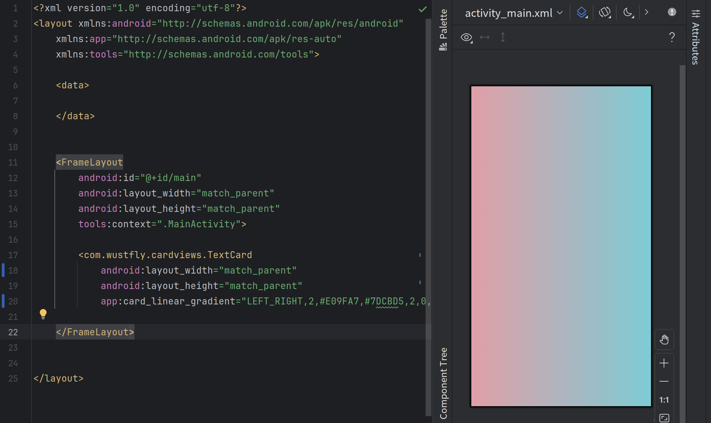

# CardViews
一款好用的android倒角（倒圆角，二阶贝塞尔倒角，三阶贝塞尔倒角）、边框、渐变UI基础组件，他是基于原生组件（FrameLayout、LinearLayout、ConstraintLayout、TextView、ImageView）扩展了更多功能，使用这些组件之后你不必再需要写那些烦人的drawable文件;

## 用法
- 线性渐变 card_linear_gradient
    
    格式：orientation,colorsNum,#FFFFFF,#000000,#FF0000,positionNum,0,0.3,1

    orientation表示线性渐变的方向，可取值如下

        字符串类型：
        LEFT_RIGHT， LT_RB， TOP_BOTTOM， RT_LB， RIGHT_LEFT， RB_LT， BOTTOM_TOP， LB_RT
        数值类型（表示角度，0表示x轴正方向，角度增加方向为顺时针方向）：
        0,33.3,45,120...
    示例:
    ```
    <com.wustfly.cardviews.TextCard
        android:layout_width="match_parent"
        android:layout_height="match_parent"
        android:layout_gravity="center"
        app:card_linear_gradient="0,2,#E09FA7,#7DCBD5,2,0,1" />
    ```
    

